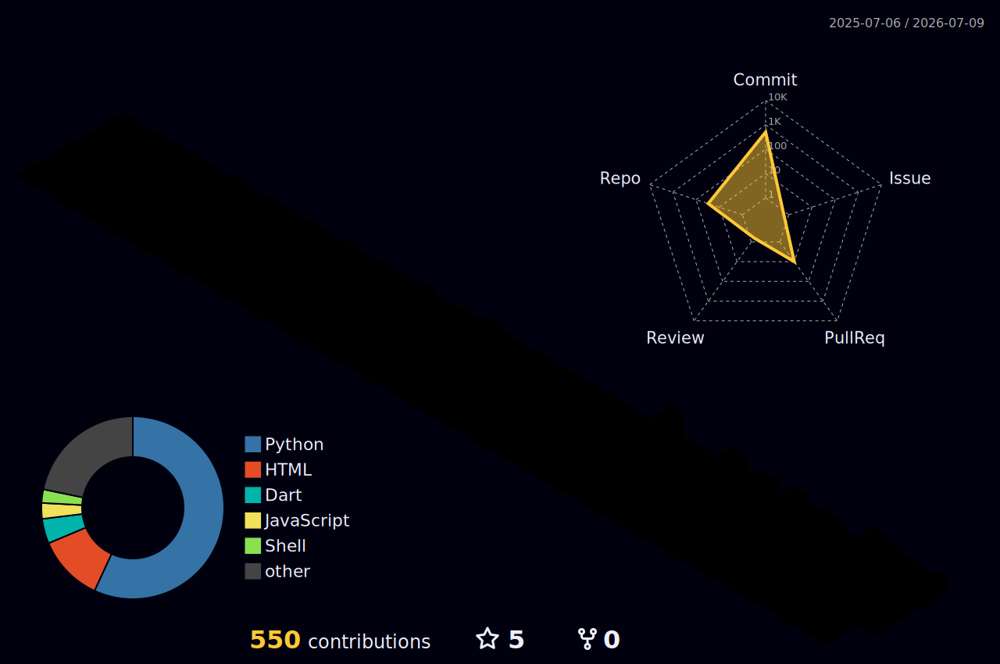

  

  

  
  
  

---

<table align="center" style="border-collapse: collapse; border: none; background: transparent; width: 100%;">
  <tr style="border: none;">
    <td width="55%" valign="top" style="border: none;">
      <h2 style="color: #00E0FF;">🧠 About_Me</h2>
      <ul>
        <li>🎓 Informatics Engineering</li>
        <li>💼 Focus: <b>Backend Systems & Mobile Apps</b></li>
        <li>🔥 Passionate about building <b>scalable products</b></li>
        <li>🏆 Built a <b>national-winning</b> waste management platform</li>
        <li>⚙️ Currently exploring <b>DevOps & Cloud Arch</b></li>
      </ul>
       
      <i>"Great software is built with logic, but perfected with intuition."</i>
    </td>
    <td width="45%" valign="top" style="border: none;">
      <h2 align="center" style="color: #00E0FF;">⚒️ Tech_Stack</h2>
      

        
          
        
          
        
      

    </td>
  </tr>
</table>

---

<h2 align="center" style="color: #00E0FF;">📊 Analytics_&_Activity</h2>

  

  

---

<h2 align="center" style="color: #00E0FF;">🌐 Digital_Infrastructure_3D</h2>

  

---

 

  

